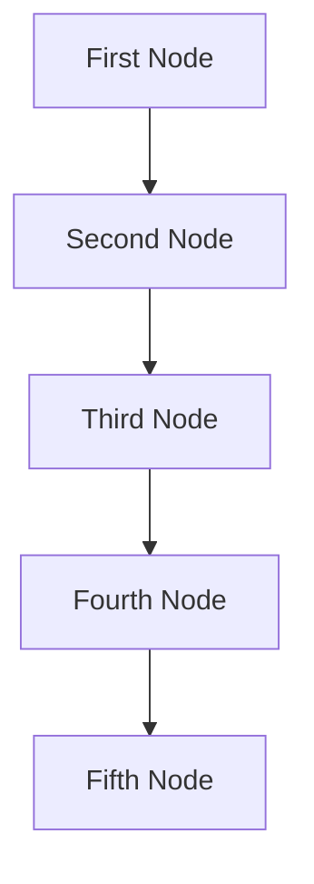
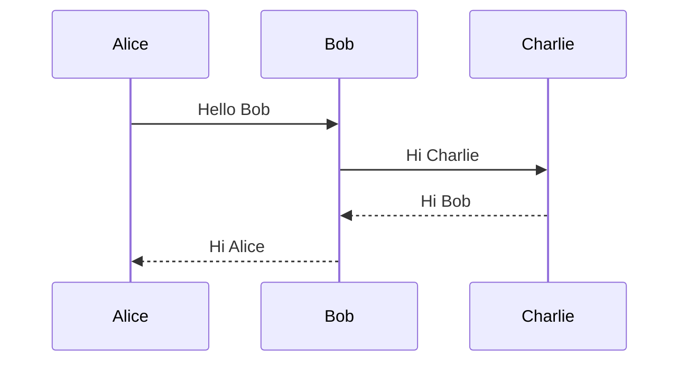
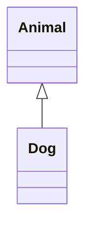

<!-- Fixture for Mermaid: flowchart, sequence, class diagrams -->

## Flowchart

```mermaid
flowchart TD
    A[First Node]
    B[Second Node]
    C[Third Node]
    D[Fourth Node]
    E[Fifth Node]
    A --> B
    B --> C
    C --> D
    D --> E
```

## Sequence Diagram

```mermaid
sequenceDiagram
    participant Alice
    participant Bob
    participant Charlie
    Alice->>Bob: Hello Bob
    Bob->>Charlie: Hi Charlie
    Charlie-->>Bob: Hi Bob
    Bob-->>Alice: Hi Alice
```

## Class Diagram

```mermaid
classDiagram
    class Animal
    class Dog
    Animal <|-- Dog
```
