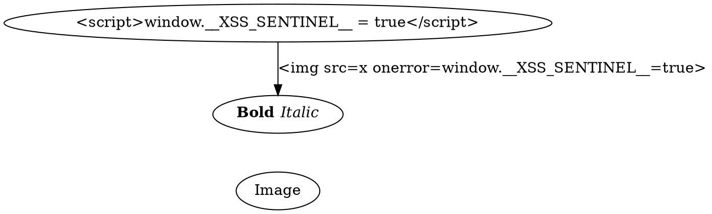

<!-- Fixture for Graphviz security: links, scripts and event attributes inside a graph -->

```dot
digraph Evil {
  A [label="<script>window.__XSS_SENTINEL__ = true</script>" URL="javascript:window.__XSS_SENTINEL__ = true" href="javascript:window.__XSS_SENTINEL__ = true" tooltip="x"];
  B [label=<<b onmouseover="window.__XSS_SENTINEL__ = true">Bold</b> <i onclick="window.__XSS_SENTINEL__ = true">Italic</i>> URL="https://example.org/"];
  C [image="https://example.org/x.png" label="Image"];
  A -> B [URL="https://example.org/edge" label="<img src=x onerror=window.__XSS_SENTINEL__=true>"];
  B -> C [style="invis" fontname="x} body{display:none} y{"];
  graph [URL="https://example.org/graph"];
}
```
